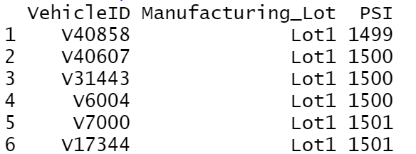

# MechaCar_Statistical_Analysis

## Objective

Create a multiple linear regression that analysis and identifies which variables amongst the datasets predict the Miles Per Gallon (mpg) of an automotive data set.

## Linear Regression Predicting MPG

### Model 1: 

##### summary(lm(mpg ~ vehicle_length + vehicle_weight + spoiler_angle + ground_clearance + AWD, data=mecha_mpg))

All of the variables checked against mpg, ground clearance, and vehicle length, are all statistically significant (2.6x10-12 and 5.2x10-8). The correlation amongst these variables is (71.5%). 

### Model 2:

##### summary(lm(mpg ~ vehicle_length + ground_clearance, data=mecha_mpg))

In running the linear regression on just the vehicle length and the ground clearance, vehicle length becomes less statistically significant (7.7x10-12 ) and ground clearance becomes more statistically significant (3.3x10-8). The correlation amongst these variables is (67.4%).

## Zero / Non-Zero Slopes

Each variable used results in the linear model having ALL Non-Zero slopes

## Linear Regression Effectiveness

Prediction is seen from the model, that the vehicle length and ground clearance, have a great effect on the mpg. Correlation is high, but also indicates other unlisted variables may be affecting mpg.

## Suspension Coils Statistics

Design specificatins are not met for all manufacturing lots. Lot 1 and Lot 2 are the only lots within the design Specifications ("the variance of the suspension coils are not to exceed 100 pounds per square inch") however, Lot 3 is off by 170% (Lot 3 Variance = 170PSI).

## Suspension Coil T-Test Results

All three lot cases result in the null hypothesis failing to reject. Yet, the differences between lots one and two are negligible. P-values are greater the 0.05. While lot three has a P-value of .04. Lot three's results indicates it is outside the population mean and is statistically significant.

## Study Design: MechaCar vs Competition

### Overview

Using data on MechaCar's competition, the means or several metrics can be compared.

### Metrics Used in Tests

Vehicle length, ground clearance, vehicle weight, engine life span, engine size, and vehicle hp.

### Null or Alternative Hypothesis

If metrics mean of either MechaCar or the competitors P-value is above 0.05 then there is not a statistical correlation. If the metrics mean is below 0.05, then there is a statistical correlation.

### Tests to Achieve Results

Multiple sampled test 

### Data Required

CSV.'s containing vehicle length, weight, ground clearance, and engine lifespan, horsepower and size. All data should have equal amount of data.
