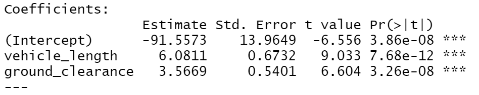

# MechaCar_Statistical_Analysis

## Objective

Create a multiple linear regression that analysis and identifies which variables amongst the datasets predict the Miles Per Gallon (mpg) of an automotive data set.

## Linear Regression Predicting MPG

